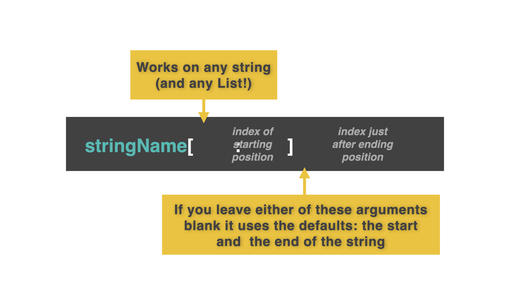

# String Slicing

Aren't strings brilliant? Yes, yes they are.

However, sometimes we might want to take part of a string to use it somewhere else. Sometimes, we might want to look at just the first letter of a string or chop it into chunks.

To do this, we use **string slicing**.


A string isn't just one big lump of text.  In fact it's a list of individual characters.  This means that we can use **indexing** just like we did with lists waaay back on Day 32.

By giving our program an index, we can specify which part of the string to chop out. 🪓🪓

*Pssst... When you see '#' followed by green text, these are comments for you. The computer will ignore it.*
## Slicing
To slice a single character from a string, you use the index of that character in square brackets `[]` _just like you'd use with a list!_ Gasp!

👉 Let's see what happens:


```python
myString = "Hello there my friend."
print(myString[0])

# This code outputs the 'H' from 'Hello'
```
##
To slice more than one character, you use two indices (yes that is the plural form of 'index'): the start character and **one after** your desired end character.


👉 Let's try it:
```python
myString = "Hello there my friend."
print(myString[6:11])

# This code outputs 'there'.
```
##
👉 Leaving the first index blank defaults to 'start from index 0'.

```python
myString = "Hello there my friend."
print(myString[:11])

# This code outputs 'Hello there'.
```
##
👉 Leaving the last index blank defaults to 'go to the end'.


```python
myString = "Hello there my friend."
print(myString[12:])
# This code outputs 'my friend.'.
```


### Try it out and see what you can slice!