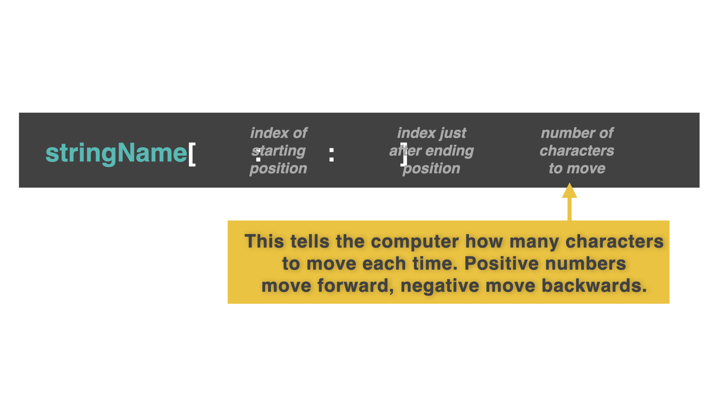

# The Secret Third Argument

Adding a third argument to the square brackets `[] ` specifies the gap left between characters.



👉 Try to `print` every other character in the word 'hello':
```python
myString = "Hello there my friend."
print(myString[0:6:2])

# This code outputs 'Hlo' (every second character from 'Hello').
```

👉 Can you `print` every *third* character in the whole string?
```python
myString = "Hello there my friend."
print(myString[::3])

# This code outputs 'Hltrmfe!' (every third character from the whole string).
```

Using a negative number in the third argument can be **super useful**. It starts the slice from the **end** of the string instead of the beginning.

👉 Can you `print` the string backwards?!
```python
myString = "Hello there my friend."
print(myString[::-1])

#This code reverses the string, outputting '.dneirf ym ereht olleH'
```

### Play around with this third secret argument. What else can you do?